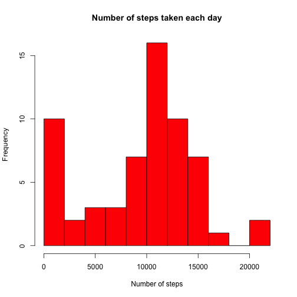
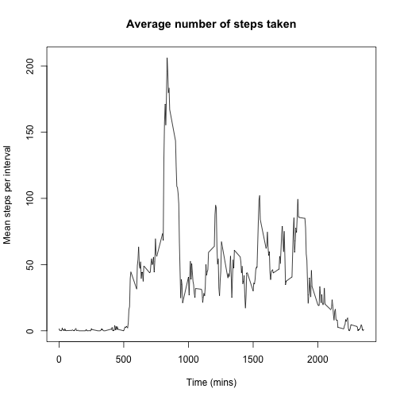
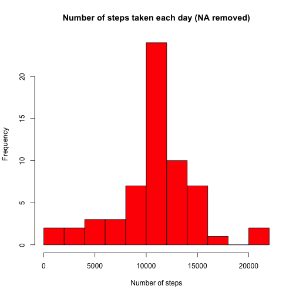

  
## *1. Introduction*
It is now possible to collect a large amount of data about personal movement using activity monitoring devices such as a Fitbit, Nike Fuelband, or Jawbone Up. These type of devices are part of the "quantified self" movement - a group of enthusiasts who take measurements about themselves regularly to improve their health, to find patterns in their behavior, or because they are tech geeks. But these data remain under-utilized both because the raw data are hard to obtain and there is a lack of statistical methods and software for processing and interpreting the data.

This assignment makes use of data from a personal activity monitoring device. This device collects data at 5 minute intervals through out the day. The data consists of two months of data from an anonymous individual collected during the months of October and November, 2012 and include the number of steps taken in 5 minute intervals each day.

The data for this assignment can be downloaded from the course web site:

Dataset: [Activity monitoring data](https://d396qusza40orc.cloudfront.net/repdata%2Fdata%2Factivity.zip) [52K]

The variables included in this dataset are:

- steps: Number of steps taking in a 5-minute interval (missing values are coded as 𝙽𝙰)
- date: The date on which the measurement was taken in YYYY-MM-DD format
- interval: Identifier for the 5-minute interval in which measurement was taken

The dataset is stored in a comma-separated-value (CSV) file and there are a total of 17,568 observations in this dataset.

## *2. Data Analysis*
    
### - *Code for reading in the dataset*  
    
First, we load the data from the file named ```activity.csv``` and assign it to variable ```table```:  
  

```r
table<-read.csv("activity.csv",na.strings = "NA")  
```
    

### - *Histogram of the total number of steps taken each day*

Use the function ```aggregate(...)``` to sum up the number of steps in each day, and then make a histogram of the total number of steps taken each day: 


```r
sumtable <- aggregate(x = table$steps, by = list(table$date), sum, na.rm = TRUE)
hist(sumtable$x, breaks = 8, main = "Number of steps taken each day", xlab = "Number of steps", col = "red")
```



### - *Mean and median number of steps taken each day*

The median of the number of steps is:


```r
medianSteps <- as.numeric(median(sumtable$x, na.rm = TRUE))
print(medianSteps)
```

```
## [1] 10395
```

And the mean of the nunmber of steps is:


```r
meanSteps <- as.numeric(mean(sumtable$x, na.rm = TRUE))
print(meanSteps)
```

```
## [1] 9354.23
```

### - *Time series plot of the average number of steps taken*

Use function ```aggregate(...)``` to calculate the mean of steps taken in the intervals:


```r
itable<-aggregate(x=table$steps,by=list(table$interval),mean, na.rm=TRUE)
```

And then make the time-series plot:


```r
plot(itable$Group.1, itable$x, type="l", main="Average number of steps taken", xlab="Time (mins)", ylab="Mean steps per interval")
```



### - *The 5-minute interval that, on average, contains the maximum number of steps*

The 5-minute interval that contains the maximum number of steps is: 


```r
maxId <-which.max(itable$x)
maxInterval <- itable$Group.1[maxId]
print(maxInterval)
```

```
## [1] 835
```

And the corresponding average value is:


```r
maxSteps <- itable$x[maxId]
print(maxSteps)
```

```
## [1] 206.1698
```

### - *Code to describe and show a strategy for imputing missing data*

The total number of missing values in the dataset is:


```r
nNA <-sum(is.na(table$steps))
print(nNA)
```

```
## [1] 2304
```

Make a copy of the original data frame, and then replace the missing values by the corresponding average values for the intervals:


```r
tableCopy <- table
nrows<- length(tableCopy$steps)

for (i in 1:nrows)  {

    if(is.na(tableCopy$steps[i]))  {
        interv <- which(itable$Group.1==tableCopy$interval[i])
        tableCopy$steps[i] <- as.numeric(itable$x[interv])
    }
}
```

### - *Histogram of the total number of steps taken each day after missing values are imputed*

Compute the mean number of steps for each interval and the total number of steps for each day using the dataset 

```r
itableCopy <- aggregate(x=tableCopy$steps,by=list(tableCopy$interval), mean, na.rm=TRUE)
sumtableCopy <- aggregate(x = tableCopy$steps, by = list(tableCopy$date), sum, na.rm = TRUE)
meanStepsCopy <- mean(sumtableCopy$x)
medianStepsCopy <- median(sumtableCopy$x)
```

Make a histogram of number of steps taken each day using the dataset with NA removed:


```r
hist(sumtableCopy$x, breaks = 8, main = "Number of steps taken each day (NA removed)", xlab = "Number of steps", col = "red")
```



Summarize the means and medians calculated using the dataset with and without NA. It is clear that imputing missing values increased the mean and median values.

||mean|median|
|---|---|---|
|With NA|9354.2295082 | 1.0395 &times; 10<sup>4</sup>|
|Without NA|1.0766189 &times; 10<sup>4</sup> | 1.0766189 &times; 10<sup>4</sup>|

### - *Panel plot comparing the average number of steps taken per 5-minute interval across weekdays and weekends*

Create a factor list ```tableCopy$days``` of two levels "Weekend" and "Weekday":


```r
days <- lapply(tableCopy$date, function(x) (weekdays(as.Date(x,"%Y-%m-%d")) == "Sunday" | weekdays(as.Date(x,"%Y-%m-%d")) == "Saturday"))
tableCopy$days <- factor(days, c("TRUE","FALSE"))
levels(tableCopy$days) <- c("Weekend","Weekday")
```

Make time-series plots for both Weekend and Weekday using ```ggplot2``` library:


```r
daystableCopy<-aggregate(x=tableCopy$steps,by=list(tableCopy$interval,tableCopy$days),mean, na.rm=TRUE)
names(daystableCopy)<-c("interval","days","steps")
suppressWarnings(library(ggplot2))

g <- ggplot(daystableCopy, aes(x = interval, y = steps))
g <- g + geom_line() 
g <- g + facet_grid(.~days)
g <- g + theme(axis.text=element_text(size=11), axis.title=element_text(size=12))
g <- g + labs(x = "Interval", y = "Average number of steps")
g + labs(title="Weekdays and Weekend Average Number of Steps Taken")
```


The resulting time-series plots show that for weekdays there is a period of time in the early part of a day  (interval~500-1000) that exhibits relatively higher activity (go to work?). For weekend days, the activity intensity looks more uniform throughout a day.
